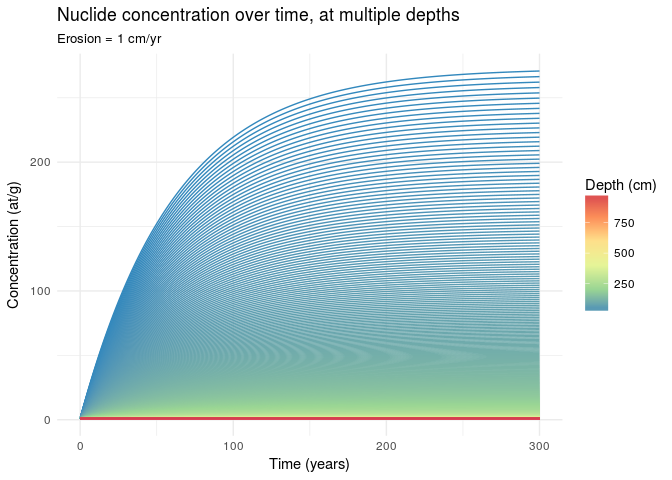

```r
library(tidyverse)
#ibrary(raster)
library(stringr)
library(rgrass7)
```

## Model specification
We use the following model for $P_z$, the production rate of $^{10}$Be at depth $z$:  
$$P_z = P_0 e^{-z\frac{\rho}{\Lambda_{spal}}} - N\lambda$$  
with parameters:  

$P_0$ is the production rate of Beryllium-10 in quartz at sea level

```r
P_0 <- 4.49		# [at/g/yr] after Stone, 1999.
```

$\lambda$ is the decay constant for $^{10}$Be

```r
ltlambda <- log(2) / 1.5e6
```

$L$ is the attenuation length for neutrons

```r
L <- 160 	# [g/cm2]
```

$\rho$ is the density of overburden

```r
rho <- 2.6 	# [ g/cm3]
```

and variables:

$N$ is the concentration of nuclides in the sample  
$z$ is the depth to that packet of sediment at time $t$   
$t$ is some length of time.  

### Assumptions  
For the sake of simplicity, we assume there is no topographic shielding (topographic shielding factor = 1) and a constant location in the Mediterranean at 40N 0E.


## Sample data
First we need base set of raster maps to initialize the variables.  
We create a multi-layer raster brick where each cell represents a 1 cm$^{3}$ packet of sediment, the **values()** of the cells correspond to $N$ (the concentration of nuclides in that packet), and the index of each layer corresponds to $1 + z$, the depth of that packet of sediment in cm.  

Lets create a sample raster brick with 5 layers of 1x1 cells, with an initial value of $N = 1$ for each cell.  

```r
N0 <- rep(1, 1000)
```

## Simulation
First translate the above formula for $P_z$ into an R function that calculates the $^{10}$Be production rate given values of $N$ and $z$.

```r
P_z <- function(N, z){
  P_0 * exp(-z*rho/L) * exp(-ltlambda) - N*ltlambda
}
```

Numerically integrate the differential equation with Euler's method. Using this function and the sample raster brick, iterate over a period of 100 years.

```r
nsim <- 100 # simulation length

N <- N0 # initial conditions

record <- data_frame(time = 0, depth = 1:length(N) - .5, value = N)

for(i in 1:nsim){
  delta <- P_z(N, (1:length(N) - .5))
  N <- N + delta
  record <- data_frame(time = i, depth = 1:length(N) - .5, value = N) %>%
    bind_rows(record, .)
}
```

Plot the resulting solution.

```r
ggplot(record, aes(x=time, y=value, group = as.factor(depth), color = depth)) + 
  geom_line() +
  scale_color_distiller(palette = 'Spectral', name = 'Depth (cm)') +
  labs(title = 'Nuclide concentration over time, at multiple depths', subtitle = 'No erosion', x = 'Time (years)', y = 'Concentration (at/g)') +
  theme_minimal()
```

<!-- -->


```r
record %>%
  filter(depth <= 500) %>%
ggplot(aes(x=value, y=depth * -1, group = as.factor(time), color = time)) + 
  geom_line() + 
  scale_color_distiller(palette = 'Spectral', name = 'Time (years)') +
  labs(title = 'Nuclide concentration depth profiles with time', subtitle = 'No erosion', x = 'Concentration (at/g)', y = 'Depth (cm)') +
  theme_minimal()
```

<!-- -->

Now rerun the simulation, adding a constant erosion rate.

```r
N <- N0 # initial conditions
nsim <- 300
record <- data_frame(time = 0, depth = 1:length(N) - .5, value = N)
for(i in 1:nsim){
  delta <- P_z(N, (1:length(N) - .5))
  N <- N + delta
  N <- N[-1] ; N <- c(N,1)
  record <- data_frame(time = i, depth = 1:length(N) - .5, value = N) %>%
    bind_rows(record, .)
}
```

We can see that, with constant erosion, nuclide concentrations reach and equilibrium point.

```r
ggplot(record, aes(x=time, y=value, group = as.factor(depth), color = depth)) + 
  geom_line() +
  scale_color_distiller(palette = 'Spectral', name = 'Depth (cm)') +
  labs(title = 'Nuclide concentration over time, at multiple depths', subtitle = 'Erosion = 1 cm/yr', x = 'Time (years)', y = 'Concentration (at/g)') +
  theme_minimal()
```

<!-- -->

Likewise, we can see that an equilibrium depth profile is reached.

```r
ggplot(record, aes(x=value, y=depth * -1, group = as.factor(time), color = time)) + 
  geom_line() + 
  scale_color_distiller(palette = 'Spectral', name = 'Time (years)') +
  labs(title = 'Nuclide concentration depth profiles with time', subtitle = 'Erosion = 1cm/yr', x = 'Concentration (at/g)', y = 'Depth (cm)') +
  theme_minimal()
```

<!-- -->

What if erosion varies over time?

```r
set.seed(1000) # set seed for reproduceability
erosion <- runif(nsim, max = 2) %>% #randomly generate a series of erosion and deposition rates
  as.integer

N <- N0 # initial conditions
record <- data_frame(time = 0, depth = 1:length(N) - .5, value = N)
for(i in 1:nsim){
  delta <- P_z(N, (1:length(N) - .5))
  N <- N + delta
  e <- erosion[i]
  if(e > 0){N = N[-(1:e)]}
  record <- data_frame(time = i, depth = 1:length(N) - .5, value = N) %>%
    bind_rows(record, .)
}
```


```r
ggplot(record, aes(x=time, y=value, group = as.factor(depth), color = depth)) + 
  geom_line() +
  scale_color_distiller(palette = 'Spectral', name = 'Depth (cm)') +
  labs(title = 'Nuclide concentration over time, at multiple depths', subtitle = 'Variable erosion', x = 'Time (years)', y = 'Concentration (at/g)') +
  theme_minimal()
```

<!-- -->


```r
ggplot(record, aes(x=value, y=depth * -1, group = as.factor(time), color = time)) + 
  geom_line(alpha = .1) + 
  scale_color_distiller(palette = 'Spectral', name = 'Time (years)') +
  labs(title = 'Nuclide concentration depth profiles with time', subtitle = 'Variable erosion', x = 'Concentration (at/g)', y = 'Depth (cm)') +
  theme_minimal()
```

<!-- -->

Now include variable erosion AND deposition

```r
erosion <- rnorm(nsim, mean = -1, sd = 1.5) %>% #randomly generate a series of erosion and deposition rates
  as.integer

N <- N0 # initial conditions
record <- data_frame(time = 0, depth = 1:length(N) - .5, value = N)
for(i in 1:nsim){
  delta <- P_z(N, (1:length(N) - .5))
  N <- N + delta
  e <- erosion[i]
  if(e > 0){N <- c(rep(1, e), N)} 
  if(e < 0){N = N[-(1:abs(e))]} 
  record <- data_frame(time = i, depth = 1:length(N) - .5, value = N) %>%
    bind_rows(record, .)
}
```


```r
ggplot(record, aes(x=time, y=value, group = as.factor(depth), color = depth)) + 
  geom_line(alpha = .5) +
  scale_color_distiller(palette = 'Spectral', name = 'Depth (cm)') +
  labs(title = 'Nuclide concentration over time, at multiple depths', subtitle = 'Variable erosion and depostion', x = 'Time (years)', y = 'Concentration (at/g)') +
  theme_minimal()
```

<!-- -->


```r
ggplot(record, aes(x=value, y=depth * -1, group = as.factor(time), color = time)) + 
  geom_line(alpha = .1) + 
  scale_color_distiller(palette = 'Spectral', name = 'Time (years)') +
  labs(title = 'Nuclide concentration depth profiles with time', subtitle = 'Variable erosion and deposition', x = 'Concentration (at/g)', y = 'Depth (cm)') +
  theme_minimal()
```

<!-- -->

## Working in GRASS
Use the rgrass7 library to try doing the same thing in GRASS, using a realistic DEM.
*Note* for the following to work, R must be called from an active GRASS session


```r
coor <- c(725763.609242,4284801.3547)

elev_init <- 'DEM'
bedrock <- 'bedrock'
init <- 1 # inital nuclide value

nsim <- 50

expr <- paste0(c('soildepth_init = if(', elev_init, ' - ', bedrock, ' < 0, 0, ', elev_init, ' - ', bedrock, ')'), collapse = '')
execGRASS('r.mapcalc', flags = c('overwrite'), expression = expr)
```


```r
init_depths <- readRAST('soildepth_init') %>% # pull in raster from grass as spatial grid data frame
  as_tibble %>% # convert to tibble %>%
  rename(x = s1, y = s2) %>%
  mutate(depth_cm = as.integer(soildepth_init * 100)) %>% # convert depths from m to cm, then to integers
  mutate(soil_column = map(depth_cm, ~ rep.int(init, .x))) # make columns of length depth with value init value
```

```
## Creating BIL support files...
## Exporting raster as floating values (bytes=8)
##    0%   3%   6%   9%  12%  15%  18%  21%  24%  27%  30%  33%  36%  39%  42%  45%  48%  51%  54%  57%  60%  63%  66%  69%  72%  75%  78%  81%  84%  87%  90%  93%  96%  99% 100%
```

```r
new <- init_depths %>% 
  mutate(soil_column = map_if(soil_column, ~ length(.x) > 0, function(x) imap_dbl(x, ~ .x + P_z(.x, z = (.y - .5)))))
```


Look at the influence of different land cover types on erosion rates.
First list out the ED rate maps for three different land cover experiments.

```r
edmaps <- execGRASS('g.list', flags = c('m'), type='rast', pattern='levol_ED_rate*', separator=',', intern = T) %>%
  str_split(',', simplify = T)
edmaps.bare <- execGRASS('g.list', flags = c('m'), type='rast', pattern='levol_bare_ED_rate*', separator=',', intern = T) %>%
  str_split(',', simplify = T)
edmaps.forest <- execGRASS('g.list', flags = c('m'), type='rast', pattern='levol_forest_ED_rate*', separator=',', intern = T) %>%
  str_split(',', simplify = T)
```

Then add them all together and plot the results

```r
execGRASS('r.series', flags = c('overwrite'), input = edmaps, output = 'erosion_total', method = 'sum')
```

```
##    0%   3%   6%   9%  12%  15%  18%  21%  24%  27%  30%  33%  36%  39%  42%  45%  48%  51%  54%  57%  60%  63%  66%  69%  72%  75%  78%  81%  84%  87%  90%  93%  96%  99% 100%
```

```r
execGRASS('r.series', flags = c('overwrite'), input = edmaps.bare, output = 'erosion_total_bare', method = 'sum')
```

```
##    0%   3%   6%   9%  12%  15%  18%  21%  24%  27%  30%  33%  36%  39%  42%  45%  48%  51%  54%  57%  60%  63%  66%  69%  72%  75%  78%  81%  84%  87%  90%  93%  96%  99% 100%
```

```r
execGRASS('r.series', flags = c('overwrite'), input = edmaps.forest, output = 'erosion_total_forest', method = 'sum')
```

```
##    0%   3%   6%   9%  12%  15%  18%  21%  24%  27%  30%  33%  36%  39%  42%  45%  48%  51%  54%  57%  60%  63%  66%  69%  72%  75%  78%  81%  84%  87%  90%  93%  96%  99% 100%
```

```r
erosion_dat <- bind_cols(readRAST('erosion_total') %>% as_tibble,
                         readRAST('erosion_total_bare') %>% as_tibble,
                         readRAST('erosion_total_forest') %>% as_tibble) %>%
  select(x = s1, y = s2, grass = erosion_total, bare = erosion_total_bare, forest = erosion_total_forest) %>%
  gather(key = 'landcover', value = 'erosion', -x, -y) %>%
  mutate(erosion = erosion * 100)  # convert meters to centimeters
```

```
## Creating BIL support files...
## Exporting raster as floating values (bytes=8)
##    0%   3%   6%   9%  12%  15%  18%  21%  24%  27%  30%  33%  36%  39%  42%  45%  48%  51%  54%  57%  60%  63%  66%  69%  72%  75%  78%  81%  84%  87%  90%  93%  96%  99% 100%
## Creating BIL support files...
## Exporting raster as floating values (bytes=8)
##    0%   3%   6%   9%  12%  15%  18%  21%  24%  27%  30%  33%  36%  39%  42%  45%  48%  51%  54%  57%  60%  63%  66%  69%  72%  75%  78%  81%  84%  87%  90%  93%  96%  99% 100%
## Creating BIL support files...
## Exporting raster as floating values (bytes=8)
##    0%   3%   6%   9%  12%  15%  18%  21%  24%  27%  30%  33%  36%  39%  42%  45%  48%  51%  54%  57%  60%  63%  66%  69%  72%  75%  78%  81%  84%  87%  90%  93%  96%  99% 100%
```

```r
ggplot(erosion_dat, aes(x, y)) +
  facet_wrap(~ landcover) +
  geom_raster(aes(fill = erosion)) +
  scale_fill_distiller(type = 'div', limits = c(-.1,.1), name = 'Elevation change (cm)') +
  geom_point(x = coor[1], y = coor[2]) +
  labs(title = 'Net erosion and deposition after 50 years', subtitle = 'Under varying land covers') +
  theme_void() +
  coord_equal()
```

<!-- -->


```r
# loop thru simulation outputs, generating the local watershed from each elevation map, add together into a master watershed 
elevmaps <- execGRASS('g.list', flags = c('m'), type='rast', pattern='levol_elevation*', separator=',', intern = T) %>%
  str_split(',', simplify = T)
for(i in 1:nsim){
  execGRASS('r.watershed', flags = c('quiet', 'overwrite'), elevation = elevmaps[i], drainage = 'fldr_tmp')
  execGRASS('r.water.outlet', flags = c('quiet', 'overwrite'), input = 'fldr_tmp', output = paste0('basin_tmp_', i), coordinates = coor)
  execGRASS('r.mapcalc', flags = c('overwrite'), expression = 'basin_tmp = if(isnull(basin_tmp), 0, 1)')
}

basinmaps <- execGRASS('g.list', flags = c('m'), type = 'rast', pattern = 'basin_tmp_*', separator = ',', intern = T) %>%
  str_split(',', simplify = T)

execGRASS('r.series', flags = c('overwrite'), input = basinmaps, output = 'basin_all', method = 'sum')
```

```
##    0%   3%   6%   9%  12%  15%  18%  21%  24%  27%  30%  33%  36%  39%  42%  45%  48%  51%  54%  57%  60%  63%  66%  69%  72%  75%  78%  81%  84%  87%  90%  93%  96%  99% 100%
```

```r
#execGRASS('r.mask', raster = 'basin_tmp', flags = c('overwrite'))
readRAST('basin_all') %>% plot
```

```
## Creating BIL support files...
## Exporting raster as floating values (bytes=8)
##    0%   3%   6%   9%  12%  15%  18%  21%  24%  27%  30%  33%  36%  39%  42%  45%  48%  51%  54%  57%  60%  63%  66%  69%  72%  75%  78%  81%  84%  87%  90%  93%  96%  99% 100%
```

<!-- -->

```r
# so most cells are in the watershed all 50 years


mask <- readRAST('basin_all') %>% 
  as_tibble %>%
  select(x = s1, y = s2)
```

```
## Creating BIL support files...
## Exporting raster as floating values (bytes=8)
##    0%   3%   6%   9%  12%  15%  18%  21%  24%  27%  30%  33%  36%  39%  42%  45%  48%  51%  54%  57%  60%  63%  66%  69%  72%  75%  78%  81%  84%  87%  90%  93%  96%  99% 100%
```

```r
semi_join(init_depths, mask) # extract only the soil columns that are in any of the simulation watershed
```

```
## Joining, by = c("x", "y")
```

```
## # A tibble: 146,284 x 5
##    soildepth_init      x       y depth_cm soil_column  
##             <dbl>  <dbl>   <dbl>    <int> <list>       
##  1            0   723535 4285669        0 <dbl [0]>    
##  2            0   723545 4285669        0 <dbl [0]>    
##  3            0   723555 4285669        0 <dbl [0]>    
##  4            0   723615 4285669        0 <dbl [0]>    
##  5            0   723625 4285669        0 <dbl [0]>    
##  6            0   723635 4285669        0 <dbl [0]>    
##  7            0   723645 4285669        0 <dbl [0]>    
##  8            0   723535 4285659        0 <dbl [0]>    
##  9           12.0 723545 4285659     1197 <dbl [1,197]>
## 10            0   723555 4285659        0 <dbl [0]>    
## # ... with 146,274 more rows
```


```r
#sample the erosion and deposition maps at core coordinates, convert to centimeters
# we'll start with the bare ground case, because deposition is high enough we don't have to worry about numerical instability yet
execGRASS('r.what', map = edmaps.bare, coordinates = coor, separator = ',', intern = T) %>%
  str_split(',', simplify = T) %>%
  .[,-(1:3)] %>%
  as.numeric %>%
  `*`(100) %>% #meters to cm
  tibble(year = 1:100, elev_change = .)
```

```
## # A tibble: 100 x 2
##     year elev_change
##    <int>       <dbl>
##  1     1        7.24
##  2     2        4.62
##  3     3        4.73
##  4     4        4.99
##  5     5        5.28
##  6     6        5.74
##  7     7        6.26
##  8     8        6.00
##  9     9        5.68
## 10    10        5.66
## # ... with 90 more rows
```

```r
#execGRASS('r.mask', flags = c('r'))
```


Select a point

for each time step:
  if erosion rate is positive:
    subtract that depth from nuclide profile
  if deposition rate is positive:
    get drainage direction map
    calculate watershed at that point using r.water.outlet
    get all the cells in that watershed
    add up the nucldie enrichment of all the cells that eroded in the watershed, average based on the depth of erosion
    add that value of nuclide in the depth of deposition  at that area.

                             

r.water.outlet --overwrite input=draindir_45@PERMANENT output=basin_temp coordinates=724673.750147,4284260.05826
